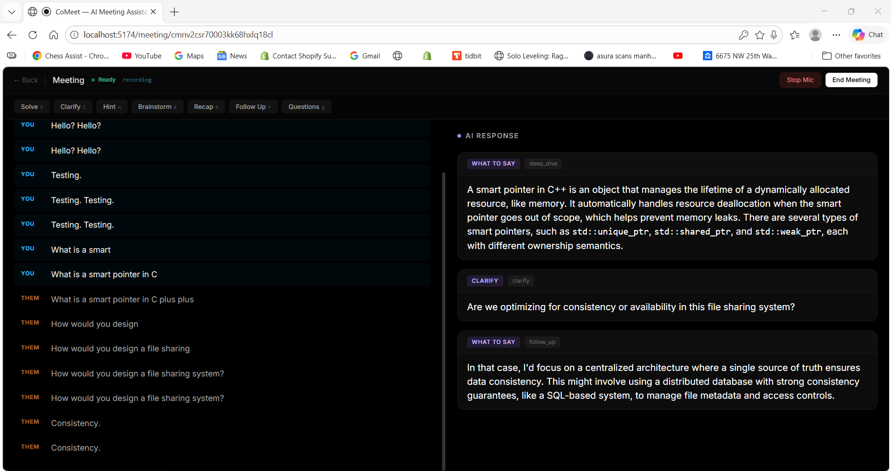

# CoMeet — Real-Time AI Interview Copilot


**A full-stack real-time AI system that transcribes live interview audio, separates speakers, and streams LLM coaching responses token-by-token — built entirely from scratch.**

---



*Live session: dual-speaker transcript (You / Them) on the left. AI responses streamed word-by-word on the right.*

---

## Highlights

| | |
|---|---|
| **94% latency reduction** | Deepgram WebSocket streaming vs. Whisper batch chunks (300ms vs. ~5s) |
| **Speaker separation** | Mic vs. system audio diarized in real time — no manual labeling |
| **Custom AI engine** | Intent classification, context assembly, multi-provider failover — not a prompt wrapper |
| **Race condition fix** | Audio buffering prevents silent drop during session initialization |
| **Multi-provider routing** | Gemini → OpenAI → Groq with automatic failover and token-stream continuity |
| **Full-stack TypeScript** | Shared types across client, server, and AI engine via npm workspaces |

---

## What It Does

CoMeet listens to your technical interview in real time. It separates what **You** say from what the **Interviewer** says, and lets you trigger AI assistance on demand — without leaving the conversation.

- **Live dual-speaker transcript** — voices diarized into You / Them lanes, results in < 300ms
- **7 AI modes** — Solve, Clarify, Code Hint, Brainstorm, Recap, Follow Up, Questions
- **Token-by-token streaming** — first AI token arrives in under 1 second
- **Multi-provider LLM fallback** — if one provider fails, the stream continues from the next
- **Connection state indicator** — Connecting → Initializing → Ready (mic gated until server confirms Deepgram is live)
- **Session history** — every transcript segment and AI response persisted per meeting

---

## Architecture

```
Browser (React + Vite)
  │
  │  Web Audio API: mic + system audio → AudioContext → MediaRecorder (WebM/Opus, 250ms chunks)
  │  WebSocket hook → sends audio_chunk (base64) → waits for { type: 'ready' } before enabling mic
  │
  ▼
Node.js Server (Express + ws)
  │
  ├─ JWT auth middleware → MeetingSessionManager (one instance per WebSocket connection)
  │
  ├─ Audio buffer [ ] ← chunks queued here while Deepgram is connecting
  │      └─ flushed once Deepgram WebSocket handshake completes → sends { type: 'ready' } to client
  │
  ├─ DeepgramService
  │      model: nova-3 | diarize: true | interim_results | utterance_end_ms | VAD events
  │      speaker 0 → "You"  |  speaker 1+ → "Them"
  │
  ├─ IntelligenceEngine (packages/ai-engine — standalone npm package)
  │      IntentClassifier      → regex fast-path (<1ms) + keyword scoring + fallback
  │      SessionTracker        → rolling transcript window, interview state
  │      TemporalContextBuilder → recency-weighted context, last-N segments, speaker roles
  │      LLMRouter             → Gemini / OpenAI / Groq, async generator, failover chain
  │      PostProcessor         → strip markdown artifacts, clamp length, clean output
  │
  └─ Prisma ORM → SQLite (Meeting, TranscriptSegment, AIResponse, User, UserSettings)
  │
  ▼
WebSocket token stream → React renders word-by-word
```

---

## Key Engineering Problems Solved

### 1. Transcription Latency — 94% Reduction

**The problem:** An earlier version used OpenAI Whisper with 5-second audio chunks. The transcript was always 5 seconds behind reality — unusable mid-conversation.

**The fix:** Replaced with a persistent Deepgram Nova-3 WebSocket. The server proxies binary audio directly from the browser WebSocket to Deepgram — no temp files, no re-encoding. Deepgram returns interim results as speech is recognized and final results at utterance boundaries.

**Result:** ~5,000ms → ~300ms end-to-end transcript latency.

---

### 2. Speaker Separation — Why the Obvious Solution Fails

**The goal:** Separate mic audio (You) from system audio (Them) so the transcript shows who said what.

**First attempt:** `multichannel=true&channels=2` in Deepgram — send two channels, get per-channel transcripts.

**Why it failed:** Deepgram's multichannel mode requires raw PCM audio per channel. Browsers can only produce audio via `MediaRecorder`, which outputs WebM/Opus — a compressed, single-container format. Sending a mono WebM file to a multichannel PCM endpoint causes Deepgram to silently return zero transcripts. The connection stays open, audio is accepted, nothing comes back.

**What works:** Mix all audio into one stream, enable `diarize: true`. Deepgram's diarization model assigns speaker IDs by voice signature. Speaker 0 (the mic, detected first) = You. Speaker 1+ = Them. Works reliably without any browser-level audio format manipulation.

---

### 3. Session Initialization Race Condition

**The symptom:** Creating a new meeting and clicking "Start Mic" immediately produced no transcripts. Clicking into an existing meeting worked fine.

**Root cause:** The message handler (`ws.on('message')`) was registered *after* `await session.start()`, which blocks for 1–3 seconds while Deepgram's WebSocket handshake completes. During that window, the browser's WebSocket was OPEN and sending audio chunks — but the server had no listener. Node.js discarded the messages. Silent loss, zero errors.

Existing meetings worked because page navigation, auth checks, and UI rendering added enough wall-clock time for Deepgram to connect before the user clicked anything.

**Fix:** Register `ws.on('message')` before `await session.start()`. Buffer arriving chunks in memory. Flush the buffer once Deepgram confirms ready. Send `{ type: 'ready' }` to the client. The mic button stays disabled until `ready` is received.

```
Before:  create session → await Deepgram connect → register ws.on('message') → first audio lost
After:   create session → register ws.on('message') → buffer audio → await Deepgram → flush buffer → send ready
```

---

### 4. The AI Engine — Built for Context Quality, Not API Convenience

`packages/ai-engine` is a standalone, event-driven TypeScript package. The design goal was to make every LLM call as precise as possible given the real-time, imperfect input.

**Tiered intent classification:** Before any LLM call, the mode trigger runs through:
1. Regex patterns (20+) — detects coding, behavioral, system design, follow-up signals in < 1ms
2. Keyword scoring — weights recent transcript terms against mode vocabularies
3. Default fallback — `what_to_say` with no penalty

This ensures the prompt sent to the LLM matches what's actually being discussed, not just which button was pressed.

**Recency-weighted context:** `TemporalContextBuilder` selects the most recent N transcript segments weighted toward the last 60 seconds — keeping context windows tight and focused on the live conversation.

**Multi-provider failover with stream continuity:** `LLMRouter` wraps each provider in an async generator. If Gemini throws mid-stream, it catches and falls through to OpenAI, then Groq. The client never sees the error — the token stream continues.

---

## Tech Stack

| Layer | Technology |
|---|---|
| Frontend | React 18, TypeScript, Vite, Tailwind CSS, Zustand |
| Backend | Node.js, Express, TypeScript, `ws` WebSocket server |
| Transcription | Deepgram Nova-3 (WebSocket streaming, diarization, VAD) |
| AI Providers | Google Gemini 2.5 Flash, OpenAI GPT-4o, Groq (Llama 3.3 70B) |
| Database | Prisma ORM + SQLite |
| Auth | JWT (access + refresh token rotation), bcrypt, SHA-256 API keys |
| Monorepo | npm workspaces — `shared`, `ai-engine`, `server`, `client` |
| Testing | Vitest |

---

## Project Structure

```
CoMeet/
├── packages/
│   ├── shared/       # Shared TypeScript types — WS message protocol, API contracts
│   ├── ai-engine/    # Intent classifier, LLM router, session tracker, context builder, post-processor
│   ├── server/       # Express REST API, WebSocket handler, Deepgram service, Prisma models
│   └── client/       # React SPA — audio capture, connection state machine, transcript + AI panels
├── package.json      # npm workspaces root
└── tsconfig.base.json
```

---

## Running Locally

```bash
git clone https://github.com/GusDawn123/CoMeet.git
cd CoMeet
npm install

# Configure environment
cp packages/server/.env.example packages/server/.env
# Fill in: DATABASE_URL, JWT_SECRET, JWT_REFRESH_SECRET

# Push schema and seed admin user
cd packages/server && npx prisma db push && npx tsx src/seed.ts

# Start both servers
cd ../.. && npm run dev
```

- Frontend → `http://localhost:5174`  
- Backend → `http://localhost:3002`

Log in → **Settings** → add your Deepgram API key + at least one LLM key → create a meeting → wait for **Ready** → click **Start Mic**.

---

## API Reference

| Method | Endpoint | Description |
|---|---|---|
| POST | `/api/auth/register` | Create account |
| POST | `/api/auth/login` | Login, returns JWT pair |
| POST | `/api/auth/refresh` | Rotate access token |
| GET | `/api/meetings` | List user meetings |
| POST | `/api/meetings` | Create meeting |
| GET/PATCH | `/api/settings` | Get/update API key settings |
| POST | `/api/api-keys` | Generate programmatic API key |
| GET | `/api/admin/stats` | Admin: system stats |
| WS | `/ws?token=&meetingId=` | Meeting WebSocket connection |

---

## What I'd Build Next

- **AudioWorklet-based channel extraction** — pull raw PCM per source before mixing, enabling true per-channel transcription without Deepgram's multichannel/WebM conflict
- **Confidence-aware rendering** — Deepgram returns per-word confidence scores; low-confidence interim words should render dimmed, not at full opacity
- **Prompt eval harness** — right now prompt tuning is manual; a recorded session test set with quality scores would make changes measurable
- **Streaming interruption handling** — gracefully surface partial output when a new mode is triggered mid-response

---

## License

MIT
