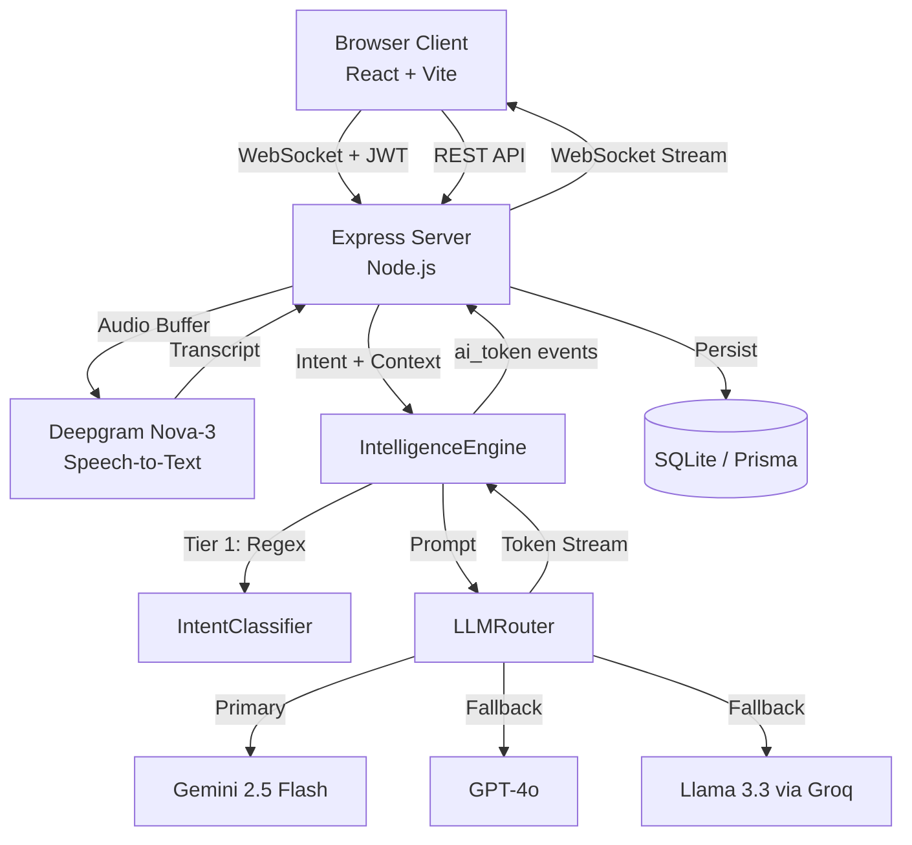

# CoMeet — AI Meeting Assistant


Real-time AI meeting assistant that transcribes live audio, classifies intent, and streams context-aware responses in milliseconds. Built as a full-stack portfolio project to demonstrate prompt engineering, streaming architecture, and production-grade backend design.

---

## Features

- **Live Transcription** — Microphone + system audio captured and streamed to Deepgram Nova-3 via server-side WebSocket proxy
- **8 AI Response Modes** — Solve, Clarify, Hint, Brainstorm, Recap, Follow Up, Questions, Idle
- **Multi-Provider LLM Fallback** — Gemini 2.5 Flash → GPT-4o → Llama 3.3 70B (Groq), automatic failover
- **3-Tier Intent Classification** — Regex fast-path (<1ms) → reserved SLM → context heuristic, zero cold-start
- **Token Streaming** — AsyncGenerator pipeline delivers first token in under 300ms
- **Anti-Repetition Engine** — Temporal context tracker detects tone, role, and prior responses to avoid redundancy
- **JWT + API Key Auth** — Dual authentication with SHA-256 hashed keys and refresh token rotation
- **Admin Panel** — System-wide stats, user management, and activity logs
- **Per-Session Isolation** — Each WebSocket connection gets its own engine instance, no cross-session bleed

---

## Architecture



### Audio Pipeline

```
Microphone ──┐
              ├──► Web Audio API Mixer ──► MediaRecorder (WebM/Opus)
System Audio ─┘         │
                         ▼
                   WebSocket (binary chunks, 250ms)
                         │
                         ▼
                   Server Buffer ──► Deepgram Nova-3 WebSocket
                                          │
                                    Transcript Result
                                          │
                                    SessionTracker ──► IntelligenceEngine
```

---

## Tech Stack

| Layer | Technology |
|---|---|
| Frontend | React 18, TypeScript, Vite, TailwindCSS, Zustand |
| Backend | Node.js, Express, TypeScript |
| Real-time | WebSocket (ws), Server-sent audio proxy |
| Database | SQLite via Prisma ORM |
| Auth | JWT (access + refresh), SHA-256 API keys |
| Speech-to-Text | Deepgram Nova-3 |
| LLM Providers | Google Gemini 2.5 Flash, OpenAI GPT-4o, Groq (Llama 3.3 70B) |
| Monorepo | npm workspaces (shared, ai-engine, server, client) |
| Testing | Vitest |

---

## Project Structure

```
CoMeet/
├── packages/
│   ├── shared/          # Shared TypeScript types
│   ├── ai-engine/       # Intent classifier, LLM router, session tracker, post-processor
│   ├── server/          # Express API, WebSocket server, Prisma, auth
│   └── client/          # React app, Zustand stores, WebSocket hooks
├── package.json         # npm workspaces root
└── tsconfig.base.json
```

---

## Getting Started

### Prerequisites

- Node.js 20+
- A [Deepgram](https://deepgram.com) API key (free tier available)
- At least one LLM key: [Gemini](https://aistudio.google.com), [OpenAI](https://platform.openai.com), or [Groq](https://console.groq.com)

### Installation

```bash
git clone https://github.com/GusDawn123/CoMeet.git
cd CoMeet
npm install
```

### Setup

```bash
# Copy environment template
cp packages/server/.env.example packages/server/.env

# Edit .env with your values
# DATABASE_URL="file:./comeet.db"
# JWT_SECRET="your-secret"
# JWT_REFRESH_SECRET="your-refresh-secret"

# Push database schema
cd packages/server && npx prisma db push

# Seed default admin user
npx tsx src/seed.ts
```

### Run

```bash
# Start both servers
npm run dev
```

- Frontend: http://localhost:5173
- Backend: http://localhost:3001

After seeding, log in with the credentials printed in your terminal. Add your API keys in Settings to enable transcription and AI responses.

---

## AI Engine Design

The `ai-engine` package is the core of the project. Key design decisions:

**Speed-first classification** — Every transcript is classified through 3 tiers before touching an LLM:
1. Regex fast-path — 20+ patterns for coding, behavioral, clarification, follow-up, system design (<1ms)
2. Context heuristic — keyword scoring against recent conversation window
3. General fallback — defaults to `what_to_say` mode

**Deterministic transcript cleaning** — Filler words, acknowledgements, and duplicate segments are removed with pure regex — no LLM calls in the cleaning pipeline.

**Post-processing clamp** — Every LLM response is stripped of markdown artifacts, filler phrases, and truncated to sentence/word limits before delivery.

**Anti-repetition** — `TemporalContextBuilder` tracks tone signals (technical/formal/casual), role context, and the last 10 assistant responses to prevent redundant answers.

---

## API Overview

| Method | Endpoint | Description |
|---|---|---|
| POST | `/api/auth/register` | Create account |
| POST | `/api/auth/login` | Login, returns JWT |
| POST | `/api/auth/refresh` | Rotate access token |
| GET | `/api/meetings` | List user meetings |
| POST | `/api/meetings` | Create meeting |
| GET | `/api/settings` | Get user settings |
| PATCH | `/api/settings` | Update API keys |
| POST | `/api/api-keys` | Generate API key |
| GET | `/api/admin/stats` | Admin: system stats |
| GET | `/api/admin/users` | Admin: all users |
| WS | `/ws` | Meeting WebSocket |

---

## License

MIT
